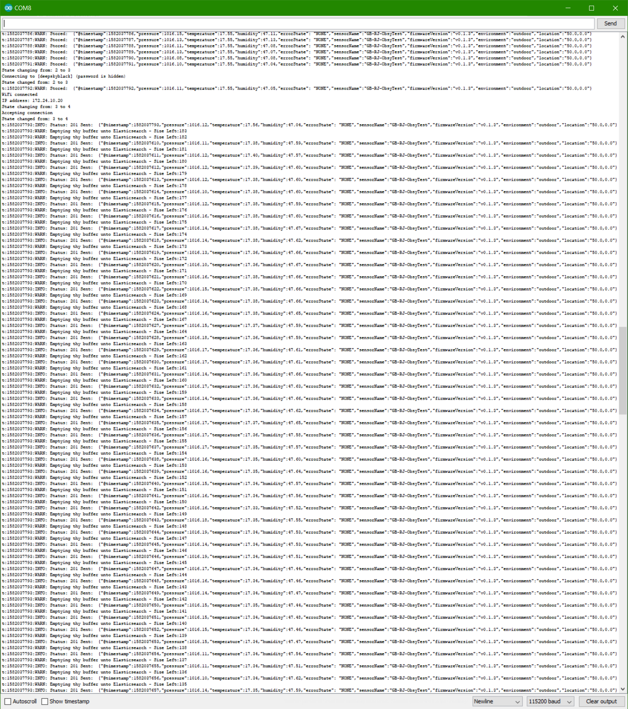
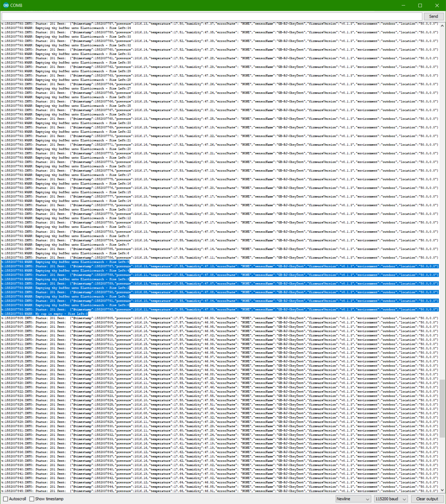
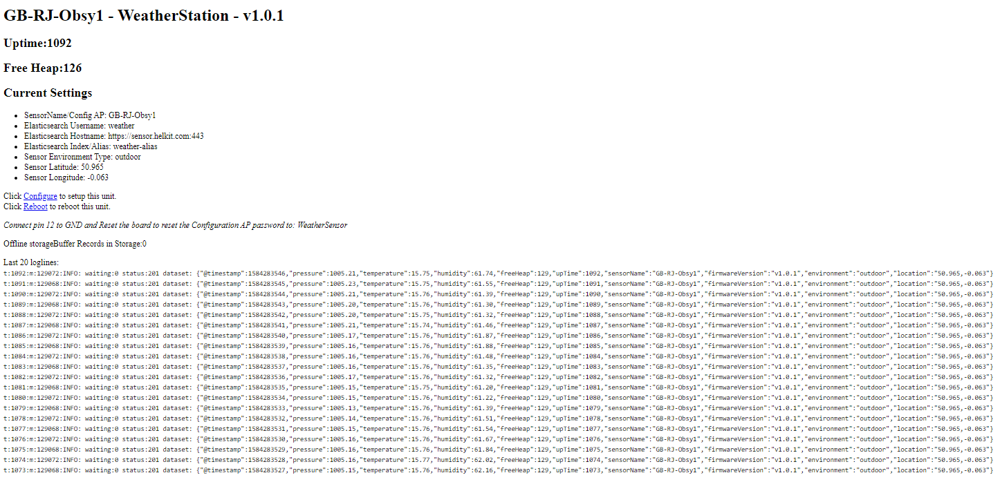

# iot-collector-elasticsearch
__Author:__ Richie Jarvis - richie@helkit.com
# Contents
- [Contents](#contents)
  * [Description](#description)
  * [Features](#features)
  * [Version History](#version-history)
  * [Feature Details](#feature-details)
    + [Internet Outage Buffer](#internet-outage-buffer)
    + [Logging on the Webpage](#logging-on-the-webpage)
- [Elasticsearch Setup](#elasticsearch-setup)
  * [Data Storage Cluster](#data-storage-cluster)
    + [Dataset](#dataset)
    + [Template](#template)
  * [Ingest Pipeline](#ingest-pipeline)
  * [Index Lifecycle Management](#index-lifecycle-management)
    + [Alerts/Watcher](#alerts-watcher)
    + [Machine Learning](#machine-learning)
  * [Monitoring Cluster](#monitoring-cluster)

<small><i><a href='http://ecotrust-canada.github.io/markdown-toc/'>Table of contents generated with markdown-toc</a></i></small>


# Description
A simple ESP32 compatible piece of code to read BME280 or BMP280 sensor data, and send via wifi to an Elastic Stack.  Other sensors may be added later on, in fact, that is the plan.


## Features
1. Auto wifi configuration using https://github.com/prampec/IotWebConf
2. Elasticsearch configuration parameters and WiFi are stored in flash on-chip once configured.
2. Read from BME280 and compatible Temperature, Pressure and Humidity sensors via i2c
3. Send JSON to Elasticsearch
4. Data Buffering during connection outages
5. Web UI with logging data
6. 300 reading buffer
7. IotWebConf (https://github.com/prampec/IotWebConf) configuration in flash memory


## Version History
* v0.0.1 - Initial Release
* v0.0.2 - Added ES params
* v0.0.3 - I2C address change tolerance & lat/long
* v0.0.4 - SSL support
* v0.1.0 - Display all the variables
* v0.1.1 - Store seconds since epoch, and increment as time passes to reduce ntp call
* v0.1.2 - Fix reset issue (oops! Connecting Pin 12 and GND does not reset AP password).
         Added indoor/outdoor parameter.
         Added Fahrenheit conversion.
* v0.1.3 - Changed the schema slightly and added a Buffer for the data, and logging to the webpage
* v1.0.0 - Initial working version with connection outage buffer
* v1.0.1 - Fixed a lot of bugs, changed freeHeap to Kilo Bytes, Reset config

# Feature Details
## Internet Outage Buffer
The idea was to have a way to store short outages.  300 readings are stored in v1.0.1.  Future versions will remove the "cruft" that I am storing currently to increase capacity.

This is the console output during an outage:

When the WiFi disconnects, the unit begins to store each reading.  After the deepskyblack WiFi AP had rebooted, after a short delay the WeatherSensor automatically reconnects, and sends the stored data into Elasticsearch.

Once the store is empty, everything goes back to normal.


## Logging on the Webpage
I wanted to make the webpage more user-friendly, and report on the current status.  Here it is:


# Elasticsearch Setup
## Data Storage Cluster
### Dataset
Here is the latest schema:
```
{
   "sensorName": "GB-RJ-Obsy1",
   "pressure": 1005.13,
   "freeHeap": 129,
   "upTime": 546,
   "environment": "outdoor",
   "@timestamp": 1584283000,
   "celsius": 15.86,
   "dewpointCelsius": 8.24,
   "dewpointFahrenheit": 46.83,
   "temperature": 15.86,
   "humidity": 61.92,
   "location": "50.0,-0.0",
   "firmwareVersion": "v1.0.1",
   "fahrenheit": 60.55
}
```
### Template
Elasticsearch will normally detect these datatypes, however, if you wish to create a template, here is what I use:

```
PUT _template/weathersensor_template
{
  "version": 1,
  "order": 1,
  "index_patterns": [
    "weather-*"
  ],
  "settings": {
    "index": {
      "lifecycle": {
        "name": "weather-ilm",
        "rollover_alias": "weather-alias"
      },
      "default_pipeline": "weathersensor-add-fields",
      "number_of_shards": "3",
      "number_of_replicas": "1"
    }
  },
  "mappings": {
    "_doc": {
      "_routing": {
        "required": false
      },
      "numeric_detection": false,
      "_meta": {},
      "_source": {
        "excludes": [],
        "includes": [],
        "enabled": true
      },
      "dynamic": true,
      "dynamic_templates": [],
      "date_detection": false,
      "properties": {
        "sensorName": {
          "type": "keyword"
        },
        "pressure": {
          "type": "float"
        },
        "upTime": {
          "type": "long"
        },
        "environment": {
          "type": "keyword"
        },
        "@timestamp": {
          "format": "epoch_second",
          "type": "date"
        },
        "celsius": {
          "type": "float"
        },
        "errorState": {
          "type": "keyword"
        },
        "dewpointCelsius": {
          "type": "float"
        },
        "dewpointFahrenheit": {
          "type": "float"
        },
        "temperature": {
          "type": "float"
        },
        "humidity": {
          "type": "float"
        },
        "location": {
          "type": "geo_point"
        },
        "fahrenheit": {
          "type": "float"
        },
        "firmwareVersion": {
          "type": "keyword"
        }
      }
    }
  }
}
```

## Ingest Pipeline
I am using an Ingest Pipeline:

```
PUT _ingest/pipeline/weathersensor-add-fields2
{
  "description": "Converts Celsius to Fahrenheit, calcs dewpoint and stores in new fields",
  "processors": [
    {
      "script": {
        "lang": "painless",
        "source": """
            if ( ctx.containsKey('celcius') ){
              ctx.remove('celcius');
            }
            ctx['celsius'] = ctx['temperature'];
            ctx['fahrenheit'] = (double)Math.round(((ctx['temperature']*9/5)+32) *100 ) /100  ;
            ctx['dewpointCelsius'] = (double)Math.round( (ctx['temperature'] - (100 - ctx['humidity']) / 5 ) *100)/100;
            ctx['dewpointFahrenheit'] = (double)Math.round(((ctx['dewpointCelsius'] * 9 / 5) + 32)*100)/100;

          """
      }
    }
  ]
}
```

## Index Lifecycle Management
These are my current recommended settings for my dataset.  Note that I am not using the recommended maximum store for performance reasons.  I am working on investigating how to optimise Elasticsearch further for my dataset, in fact, that is my day-job!

```
PUT _ilm/policy/weather-ilm
{
  "policy": {
    "phases": {
      "hot": {
        "min_age": "0ms",
        "actions": {
          "rollover": {
            "max_size": "1gb",
            "max_docs": 2000000
          },
          "set_priority": {
            "priority": 100
          }
        }
      }
    }
  }
}
```

### Alerts/Watcher
tbc

### Machine Learning
tbc

## Monitoring Cluster
The intention is to expand this section with ready-to-go REST calls to keep a Monitoring Cluster tidy.

* Index Lifecycle Management for System Indices
To keep Elasticsearch tidy, I decided to use the lovely Hot/Warm Cloud architecture.  This setup will automatically allow Elasticsearch to create the daily indices, then roll them to gradually less speedy resource states until they are deleted after 7 days.

This will stop Monitoring from over-filling the Cluster.

```
PUT _ilm/policy/SystemIndexPolicy
{
  "policy": {
    "phases": {
      "hot": {
        "min_age": "0ms",
        "actions": {
          "rollover": {
            "max_size": "50gb"
          },
          "set_priority": {
            "priority": 100
          }
        }
      },
      "warm": {
        "actions": {
          "allocate": {
            "number_of_replicas": 1,
            "include": {},
            "exclude": {}
          },
          "shrink": {
            "number_of_shards": 1
          },
          "forcemerge": {
            "max_num_segments": 10
          },
          "set_priority": {
            "priority": 50
          }
        }
      },
      "cold": {
        "min_age": "5d",
        "actions": {
          "freeze": {},
          "set_priority": {
            "priority": 0
          }
        }
      },
      "delete": {
        "min_age": "7d",
        "actions": {
          "delete": {}
        }
      }
    }
  }
}
```
* Alerts/Watcher
tbc
